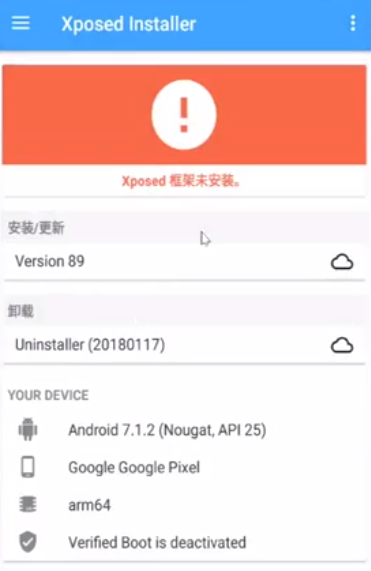

# 安卓镜像
查看安卓版本及支持的设备 \
https://source.android.com/setup/start/build-numbers#source-code-tags-and-builds

安卓镜像 \
https://developers.google.com/android/images

[Nexus 5X](https://dl.google.com/dl/android/aosp/bullhead-n2g47o-factory-3ff32f55.zip)

# Xposed
windows 下载传到 Kali
https://forum.xda-developers.com/attachments/xposedinstaller_3-1-5-apk.4393082/

# SuperSU
https://download.chainfire.eu/1220/SuperSU/SR5-SuperSU-v2.82-SR5-20171001224502.zip?retrieve_file=1

# TWRP
版本和安卓镜像版本要对应
https://eu.dl.twrp.me/bullhead/twrp-3.3.1-0-bullhead.img

# 步骤
1. 安卓镜像
2. twrp
3. SuperSU

正常刷机即可
如果 fastboot 刷机失败或者卡在开机界面, 需要更换 fastboot 版本

xposed 安装完成界面 \

