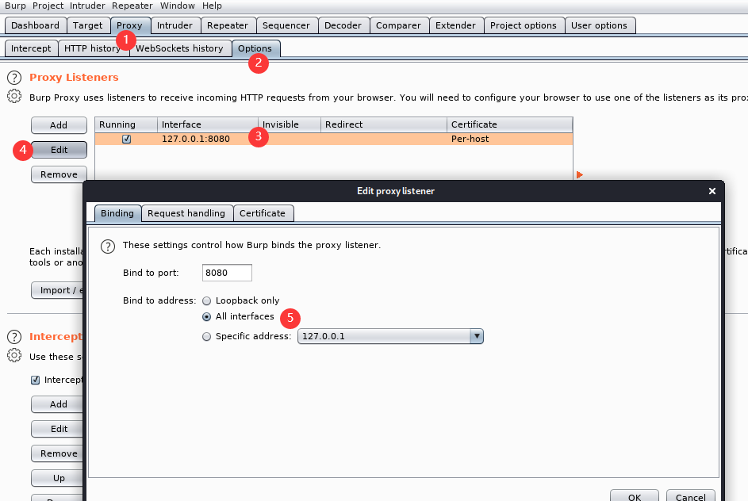

# 虚拟机配置
网卡设置为 桥接模式，并保证使用的网卡可以在路由器上获取IP

# charles
```shell
wget https://www.charlesproxy.com/assets/release/4.6.1/charles-proxy-4.6.1_amd64.tar.gz
tar zxvf charles-proxy-4.6.1_amd64.tar.gz
```

破解网站 \
https://www.zzzmode.com/mytools/charles/
```shell
# 查找 charles.jar 所在目录
tree -NCfhl | grep charles.jar
```

# burp
安装破解方法参考
https://blog.csdn.net/u014549283/article/details/81248886

安装完成之后配置
```text
# 启动
java -jar burploader.jar
```




# postern
http://cn.4androidapk.com/download-software-47775.html